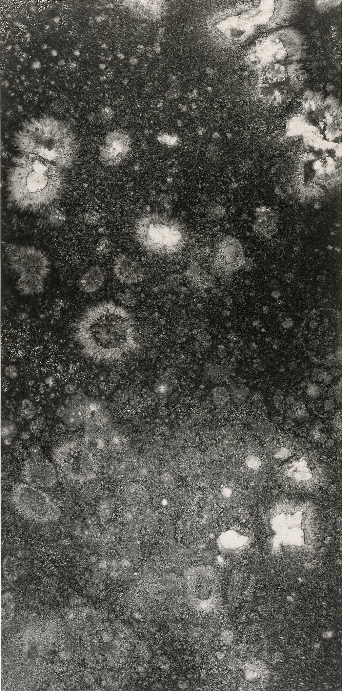

I'm Andrew, and this is my internet home. 

This is a space I built to nest all the parts, treasures, artifacts and multitudes of myself that sometimes feel too raw, unpolished, or even weird to share anywhere else. 

It's space that mirrors more closely the online and even offline spaces that I gravitate towards lately: spaces that feels off the busier streets and one that grounded in an intentional stillness & quiet. 

One that feels cozy, warm, and hopefully invites you to kick back with a hot tea in hand to stay, wander, and hopefully find something (maybe even a gift) that one can bring home wit them.

This is a space that is constantly evolving because I am constantly evolving. 

I hope you find what you need here.
Here are some places you may want to start: 
- Learn more about what i'm doing [now](now.md)
- Read about where I'm at with my [[coaching]] or one of my favorite poems I've writted called [the joy of being me](my%20writing/the%20joy%20of%20being%20me.md)
- Enjoy some of [[my art]] or listen to [my playlists](my%20playlists/index.md)

If you want to see more of me you can always come say hi on [Instagram](https://www.instagram.com/atsaotsao/), [TikTok](https://www.tiktok.com/@atsaotsao?lang=en), [Youtube](https://www.youtube.com/@atsaotsao), or [Linkedin](https://www.linkedin.com/in/andrew-tsao/)

---

 <a href="/graph" class="wander-button">🗺️ Wander</a> 

[graph](graph.md)

*Last updated: 2025-08-26 00:02*
