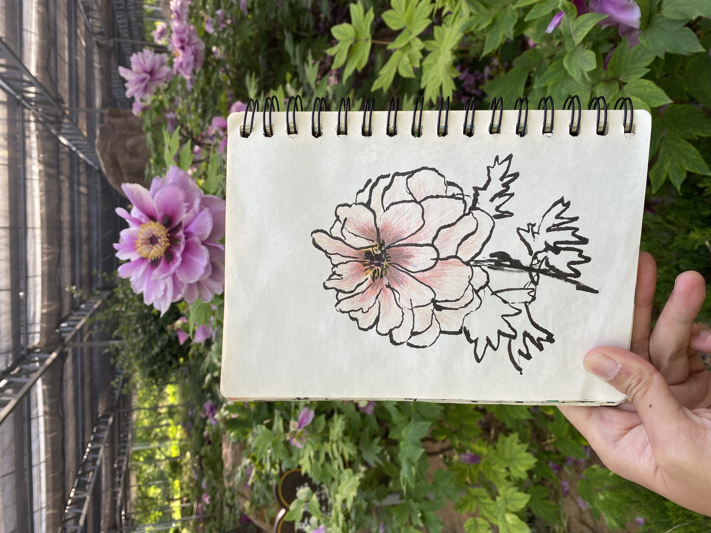

---
title:
publish: true
type: 🌳
published: 2026-05-14
creation date: 2026-04-18
modified: 2026-05-14 15:04:15
status: completed
tags:
  - poem
---

I have never looked at a flower the way I look at you. 
The way you blossom in the morning light,
your face effervescent with pearl-like joy,
your cheeks delicately pink and shy from seeing me. 
I feel my body move in harmony to lean in, 
to take a breath of the scent of your love. 

I have never wished more I was a bee.
So I can inch more closely and feel my fingers on every layer of your petals,
to glide gently across the gradient of your body,
past the sun-kissed circle,
to taste the sweet nectar in the center. 

I want so badly to snuggle into your chest as we embrace in this fleeting moment,
and feel the cosmic ripple effects of this dance, 
feeding life all around us. 

I have never been more scared of the changing seasons. 
The heat of the equator summer sun blasting our skins with heated uncertainty,
The fall winds of change, howling so loudly my tiny buzzing can barely be heard,
The cold chill of winter where we crave the warmth of bodies, 
And the coming of next spring where moments start to become cycles. 

I fear I can’t be there for you on days where you wither,
and from the hurt you create thorny walls,
and I can no longer reach you.

I fear the violent Man and his power to pull you from the ground,
and cast you into storm,
and I won’t be able to find you. 

I have never looked at a flower the way I look at you.
And there may come a day where I may not be able to. 
But for now, I will enjoy the bloom. 

