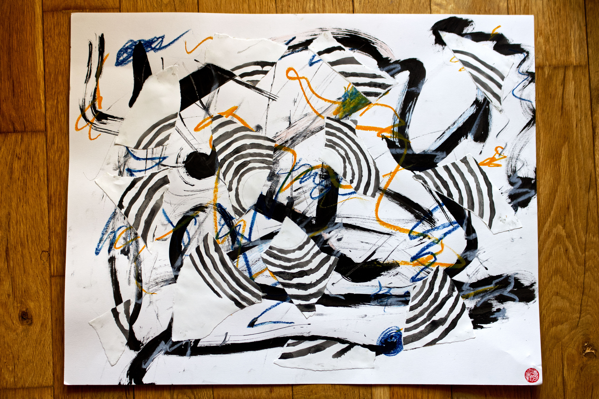

I really did break one of my calligraphy brushes for this. 

I've been learning to trust that the canvas and my art can hold the full weight, volume, and intensity of my anger, this large tangled up knot of anger that is passed down from both sides of my family. I've been a student of this rage for a long long time and it took years of therapy sessions and self work to differentiate between what it feels like to be *in* the state of rage vs be *with* the state of rage. 

And for the longest time, I struggle to actually draw when I'm in it. When I feel my blood boil, my head gets cloudy, and I can feel tension forming in my chest, my jaws, and even in my forehead. And it took a long time to learn to also not push the anger with it, to be with it longer enough to be with it, observe it, and tend to the part that never felt like he had the space and safety to feel those very real emotions. 

This painting felt like a breakthrough and half. It was the first time I felt the shift from *in* to *with*, and I felt the impulse to finally draw those shapes so that it can be witnessed by me and now by you. Part of my ancestral assignment that I feel deep in my bones is for the anger in this lineage to be witnessed, transformed, and alchemized into something for positive changes in the world. 

Thank you for being here to witness my anger with me

#### Song inspiration for this piece: 
[Let You Down - NF](https://open.spotify.com/track/52okn5MNA47tk87PeZJLEL?si=db931ec489b64288)

