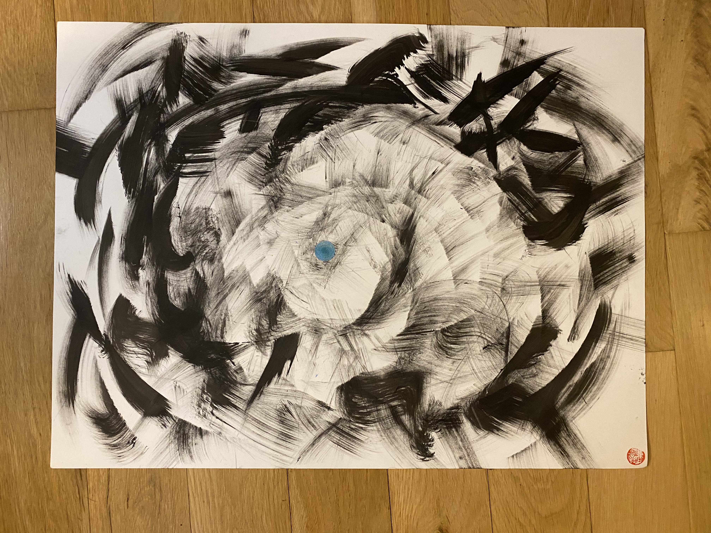
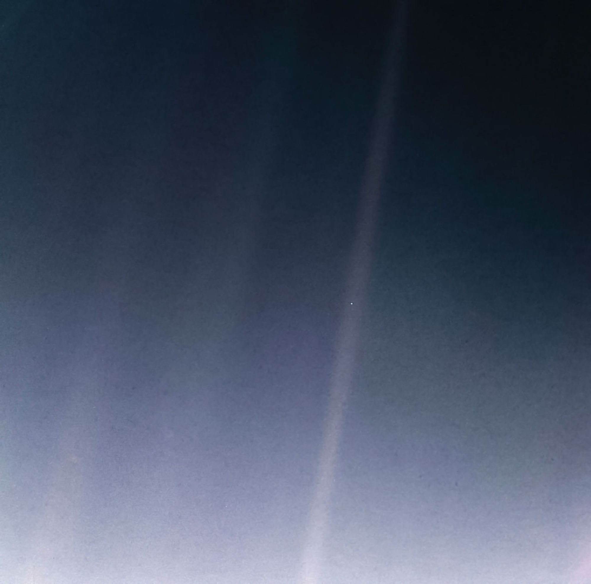

I drew this piece on the night of Christmas Eve because I was feeling this duality of feeling lonely and isolated, yet at the same time also feeling energized, loved, and interconnected with the world around me. 

This piece reminded me of the famous photo taken by NASA's Voyager 1 spacecraft in 1989. The story goes that they were on a mission to take atmospheric readings from space but the late astronomer Carl Sagan asked for the camera to be turned backwards to capture one last snapshot of earth. The result of it was the first portrait of our planet from the edge of the solar system 3.7 billion miles away, with an image of the earth measuring  0.12 pixels in size.

Sagan later gave the image the name "the pale blue dot"

Sometimes I feel like a blue dot, sphere, shape, blob, floating in the vastness of space that is ever changing, ever expanding, ever shrinking, ever disintegrating. And there are days I can feel so small and scared. But when you take a step back, way back, 3.7 billion miles away back, you see this blue dot and it doesn't feel all pointless. 

I remember reading what Sagan wrote about this picture:
"Look again at that dot. That's here. That's home. That's us. On it everyone you love, everyone you know, everyone you ever heard of, every human being who ever was, lived out their lives. The aggregate of our joy and suffering, thousands of confident religions, ideologies, and economic doctrines, every hunter and forager, every hero and coward, every creator and destroyer of civilization, every king and peasant, every young couple in love, every mother and father, hopeful child, inventor and explorer, every teacher of morals, every corrupt politician, every "superstar," every "supreme leader," every saint and sinner in the history of our species lived there--on a mote of dust suspended in a sunbeam...

Our posturings, our imagined self-importance, the delusion that we have some privileged position in the Universe, are challenged by this point of pale light. Our planet is a lonely speck in the great enveloping cosmic dark. In our obscurity, in all this vastness, there is no hint that help will come from elsewhere to save us from ourselves...

It has been said that astronomy is a humbling and character-building experience. There is perhaps no better demonstration of the folly of human conceits than this distant image of our tiny world. To me, it underscores our responsibility to deal more kindly with one another, and to preserve and cherish the pale blue dot, the only home we've ever known."

I hope this painting reminds you to cherish the earth, be kind to yourself and anyone you meet, and to remember to nurture and fight for the only home we've ever known 🌏

#### Song inspiration for this piece: 
[Angels - Dark Sky](https://open.spotify.com/track/0ZrpYZAJWku0zk4i0WVXUT?si=080cc3b3716b4c6e)

