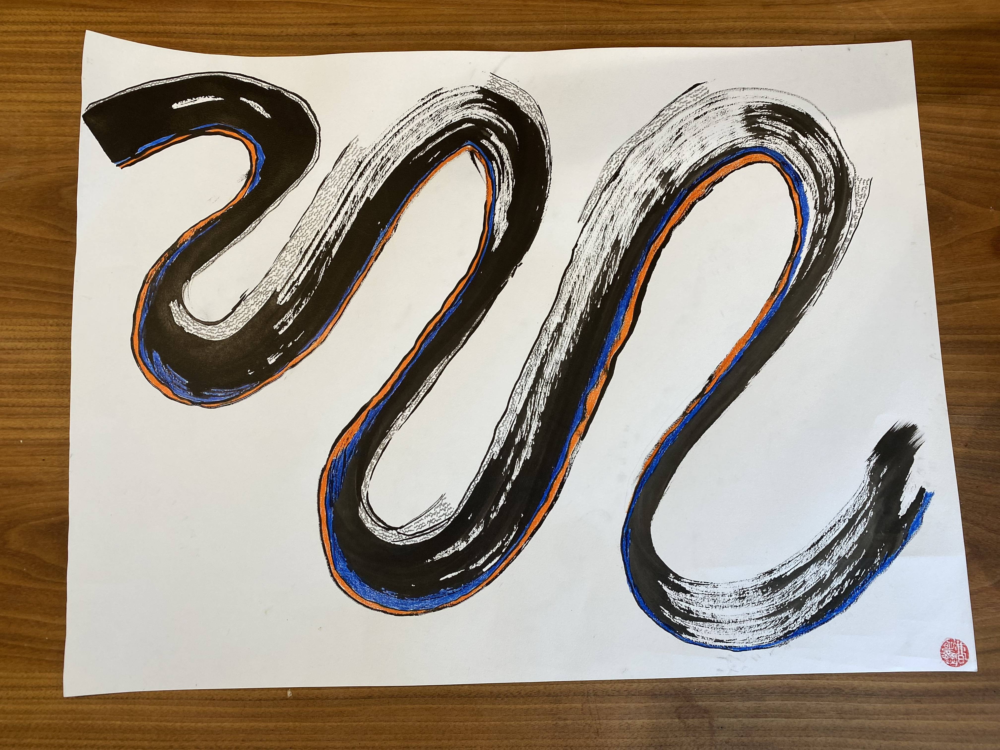
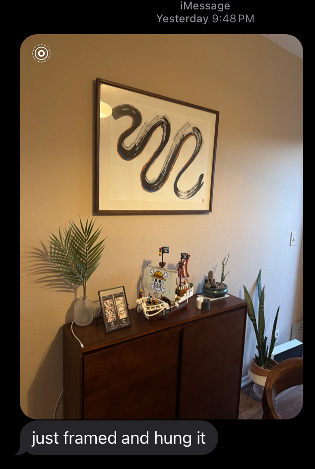

I created this piece as a housewarming gift to friends who enjoy surfing the warm California waters. 

I always love seeing how imperfectly ink flows across a page, for me illustrating the inexplicable, unpredictable yet magical tendency that life likes to flow; whether we like it or not. The biggest lessons I have learned so far is the art of flowing with it, and not against it. 

This was the personal message I included alongside the painting:

*I hope this piece brings you and O peace, courage, joy in surfing the waves of your lives together.*
*That regardless of how choppy the conditions the water gets, you will always have each other to lean on.*
*That you have all that you need to navigate through any ripples and swells that comes your way.*
*I hope it's filled with sunrises and sunsets.*

*May it bless your home with spirit, love, and light.*

#### Song inspiration for this piece: 
[Be Like Water - Indigo De Souza](https://open.spotify.com/track/24BJoWF10bBVsZe0nCq2nj?si=2fbfbfde0f114eee)

