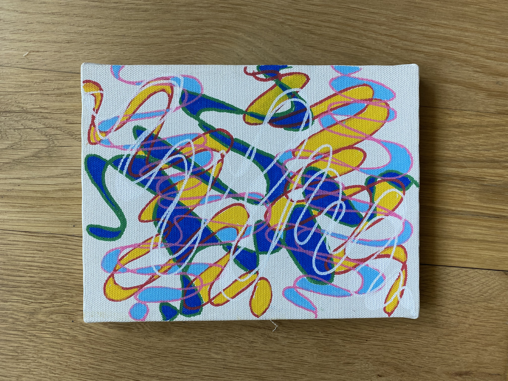

When I first picked up a marker to draw for the first time in 12+ years, the tactile experience using of it dancing on paper completely drew me in. In that moment, I felt a lot of noise around sadness, self-loathing,  shame, and guilt dissipate. I found myself in a similar peaceful space when I'm doing my morning meditation. This piece reminds me a story behind one of my favorite musician's song:

> The phrase "ekki hugsa" was handed to me on a piece of paper by a stranger once. I went home and put it on my wall. It's been my mantra ever since. It means "don't think"

Sometimes doing bold creative things is to gently ask our brains who is often working so so hard to just let go of control, to stop thinking, and start being. See what magic emerges, I dare you.

🖼️ Room mockups are created using AI to help you envision the artwork in different settings. Please note that colors, textures, and proportions may not be fully accurate since the mockups are generated through AI.
#### Song inspiration for this piece: 
[ekki hugsa - Olafur Arnalds](https://open.spotify.com/track/7fRvTEbngyFprSPRvRDyM8?si=97cd552e074d4351)

