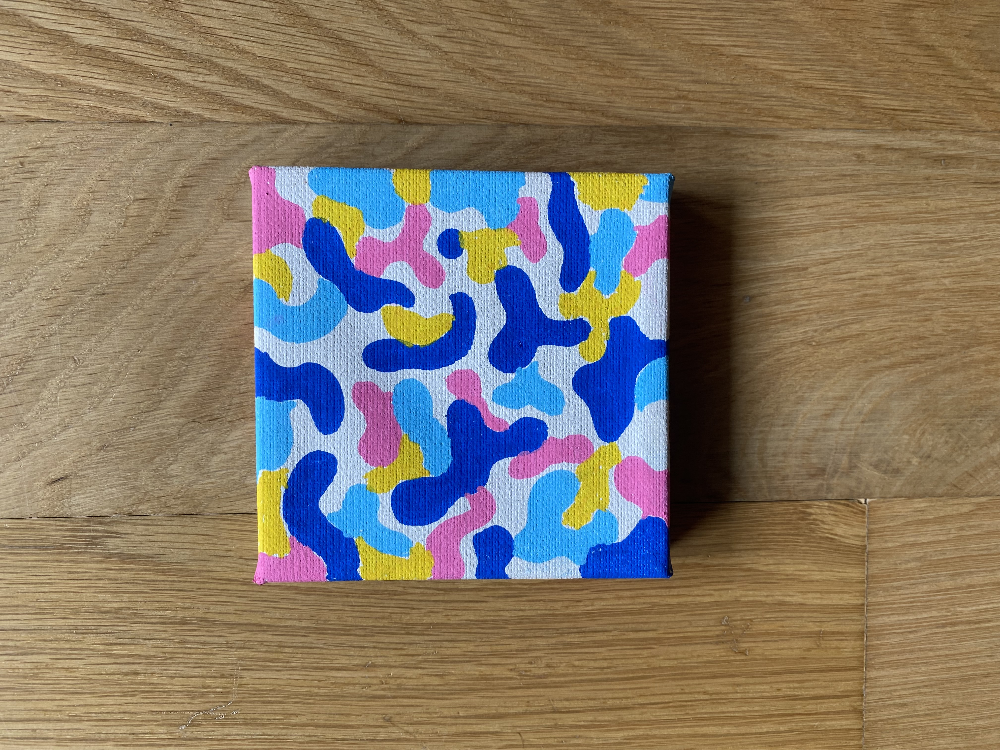

It might not look like it but I used to work in tech for 6+ years. And one of the main lessons around building or creating anything is to smart small. To start with the tiniest version of the idea, an experiment if you will, and go from there. This tiny 4" x 4" painting was the first tiny step into drawing on canvas to me. I had one laying around and it was the first piece I drew on canvas, and I was hooked ever since. And I think if people like it, I would create more of these.

If I can swim in colors, these are the 4 colors I want to swim in on a daily basis. They make me feel happy. They feel the complementing emotions in my body. And I love how when my partner first saw it she named it "Electric Cow." I hope you enjoy it too.

🖼️ Room mockups are created using AI to help you envision the artwork in different settings. Please note that colors, textures, and pmn roportions may not be fully accurate since the mockups are generated through AI.
#### Song inspiration for this piece: 
[Here Comes The Sun - Nina Simone](https://open.spotify.com/track/1x9ahz0ALGHgbN9wwDjmre?si=9ac6374d2b2e40e5)
