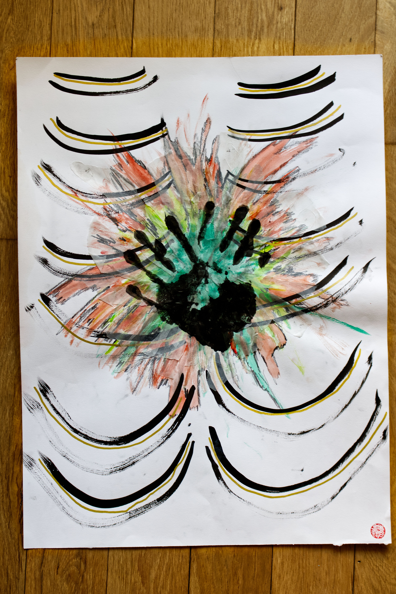

I drew this piece in a blind fury of intense grief and rage. There was this knot in my chest that I was trying to process and it was suffocating me. In my journal I wrote: 
*"It makes me want to scream punch the wall. It makes me want to launch myself at structures and people like I'm a catapult shooting rocks at walls and castles during medieval times."*

This piece is one of my first attempts to capture the full intensity around the weight in the chest, the rage, the mourning, and the strange companionship of what refuses to leave. Looking at it again, it felt like a lesson and reminder to myself around not pushing grief away but moving through it. What also moved me was when I shared this as an IG story, I was so surprised at how many people said to me that they resonate or felt seen in this piece.

Here is the full excerpt of what I wrote in my journal:
*The knot in my chest is so heavy & deep.*
*I've cried.*
*I've wallowed.* 
*I've raged.*
*I've screamed.*
*I've distracted.*
*I've danced.*
*I've drew.*
*I've mourned.*
 
*I've done anything I can think of but it's still there.* 
*It scares the absolute shit out of me.* 

*It makes me want to scream punch the wall.* 
*It makes me want to launch myself at structures and people like I'm a catapult shooting rocks at walls and castles during medieval times.*

*I'm also so scared to admit this is my own doing.* 

*That I'm causing my suffering.*
*That I'm responsible for the lack of feeling safe.*
*That I'm still accountable for the shitty feelings in my body.* 
*What a bore to take responsilbity fo this.*
*How fun is it to blame it on others.*

*How frustrating it is there just fucking making itself comfortable. Like a toad in a castle, just chilling and unwilling to move.*
*What do you need. Have you found a new home even though I don't want you here?*

*O knot, O knot*
*What do you need from me?*

I hope this can be reminder for anyone going through something to know that they're not alone. 
And to keep going.
#### Song inspiration for this piece: 
[United in Grief - Kendrick Lamar](https://open.spotify.com/track/5Gt9bxniM1SxN61yRzRhXL?si=842f823dfc964efa)

