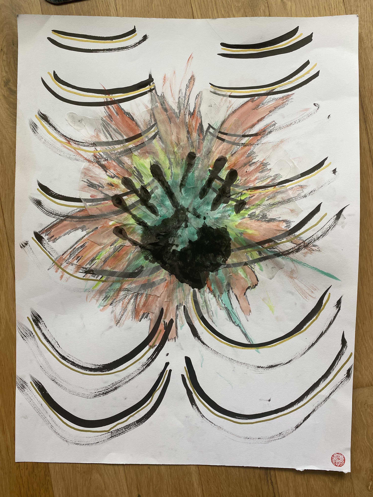

> An explosive floral burst rendered in vibrant watercolors and ink with dynamic gestural marks radiating outward like energy waves coming out of the center of the chest. The two hand prints are meant to symbolize safety and support through navigating one's shadows.

What I wrote in after painting this: 
*The knot in my chest is so heavy & deep.*
*I've cried.*
*I've wallowed.* 
*I've raged.*
*I've screamed.*
*I've distracted.*
*I've smoked.*
*I've danced.*
*I've drew.*
*I've mourned.*
 
*I've done anything I can think of but it's still there.* 
*It scares the absolute shit out of me.* 

*It makes me want to scream punch the wall.* 
*It makes me want to launch myself at structures and people like I'm a catapult shooting rocks at walls and castles during medieval times.*

*I'm also so scared to admit this is my own doing.* 

*That I'm causing my suffering.*
*That I'm responsible for the lack of feeling safe.*
*That I'm still accountable for the shitty feelings in my body.* 
*What a bore to take responsilbity fo this.*
*How fun is it to blame it on others.*

*How frustrating it is there just fucking making itself comfortable. Like a toad in a castle, just chilling and unwilling to move.*
*What do you need. Have you found a new home even though I don't want you here?*

*O knot, O knot*
*What do you need from me?*

#### Song inspiration for this piece: 
[United in Grief - Kendrick Lamar](https://open.spotify.com/track/5Gt9bxniM1SxN61yRzRhXL?si=842f823dfc964efa)

