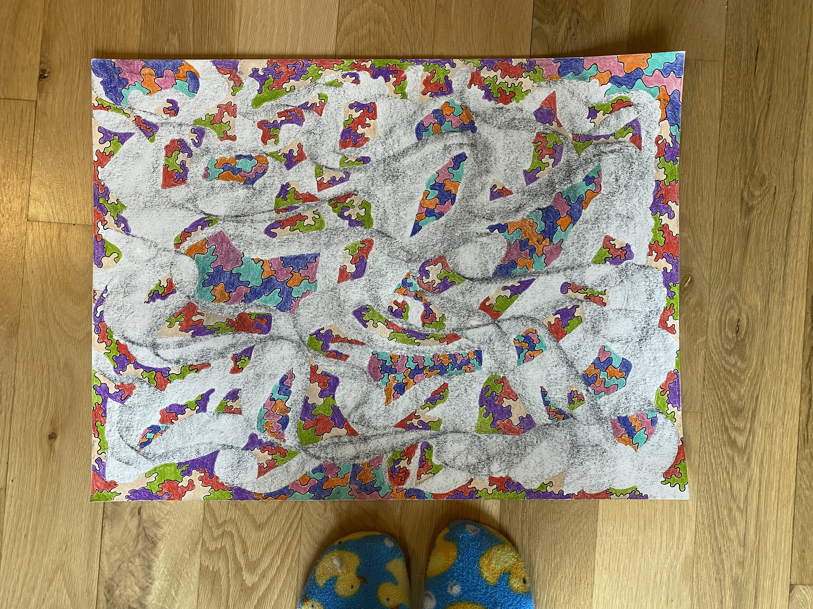

#### Description:
I drew this piece right after the world started opening up after the pandemic in 2020-2021 to remind myself of the spaces of connection and movement that I was craving. I was imagining bodies of color clustering and bouncing off of each other in a dark smoky room.

#### Song inspiration for this piece: 
[Kyle (i found you) - Fred again..](https://open.spotify.com/track/6Ao5d7TMQ92h87jQqSHGyw?si=c8959191bb77445b)

