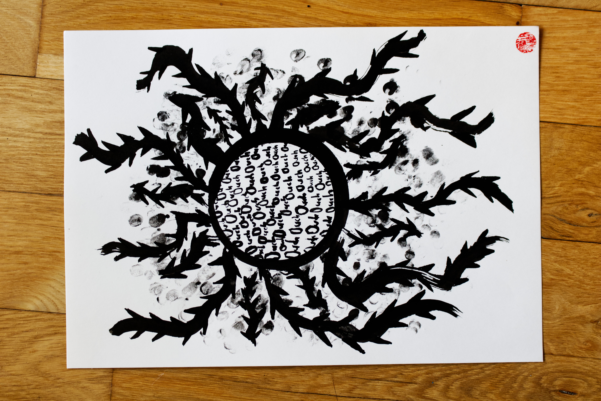

I imagined myself being surrounded by spiky thorns when I drew this. This feeling of one day looking up, and wrapped up a wall of it, and not knowing how to find a way out. The more I pushed, the more I hurt my hands and the finger prints were me imagining trying to wipe the blood, sweat, and soil on the paper to keep going. Yet instead of actualy yelping, making sounds to signal help, I swallow them. Creating a soup of "ouches" that can't be digested. There is grief in recognizing moments where our inabilities to ask for help sinks us deeper into a spiral of hurt. 
#### Song inspiration for this piece: 
[Old Skin - Olafur Arnalds, Arnór Dan](https://open.spotify.com/track/3elnTuEnOdox7Utg9nU6pz?si=6be2a6359df54c4f)

