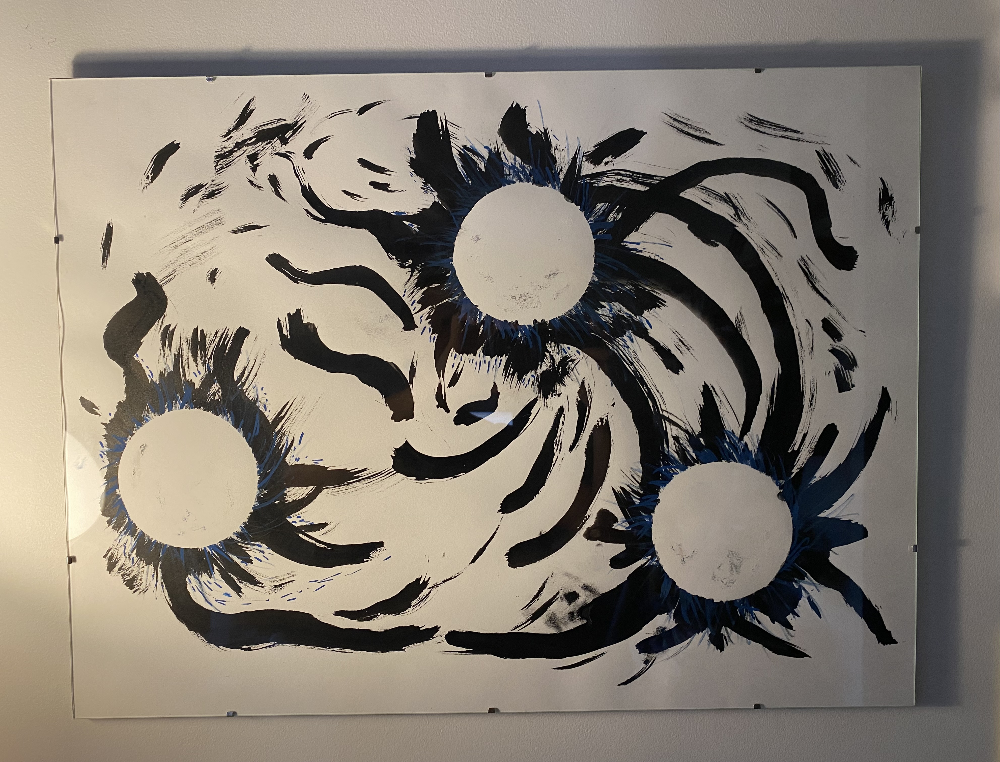

One of my earlier ink art pieces and whenever I see this piece I think about the Zen Buddhist concept of interbeing. The idea is from a famoust quote from Vietnamese monk and peace activist Thich Nhat Hanh:
> To be is to inter-be

It's rooted in the idea that we do not exist independently. Take a flower for example, when we look at flower we aren't looking just at the flower. It doesn't exist as itself. We are also seeing the sun, the soil, the photosynthesis and how they are all present in what we are seeing. 

And when I see this painting I see my physical body, my emotional body, and my spiritual body. The three planets orbiting with and around each other. 

I hope you enjoy!

#### Song inspiration for this piece: 
[Small Hours - John Martyn](https://open.spotify.com/album/78WlsSQKrX4suYf909Fcrm?si=eH_R7MrtQ5mAWNmnT931yA)

