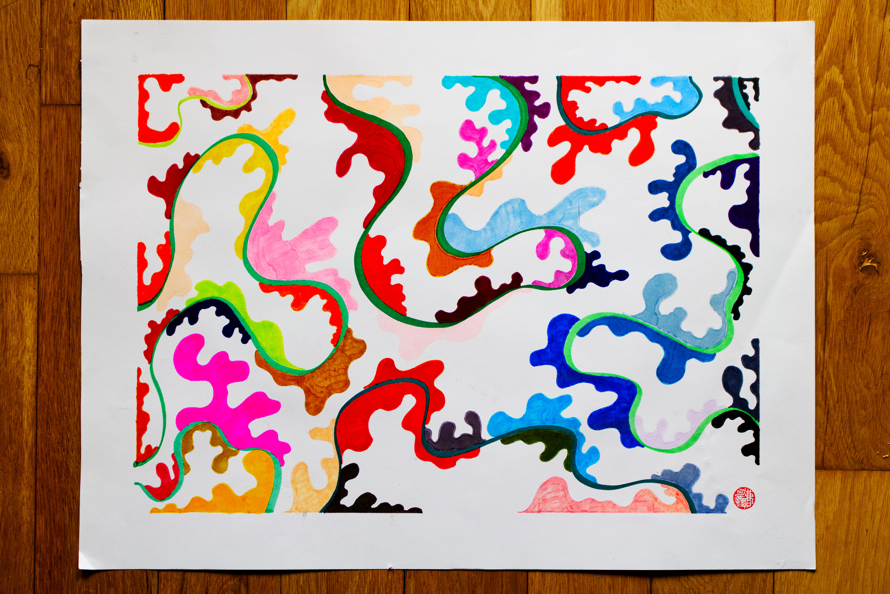

Recently a friend lent me a pack of alcohol markers and I felt inspired to use it. Sometimes when I find when I pick up a marker, a brush, a color pencil, I like to ask it what he or she wants to draw. And this time around, I heard almost a chorus of voices from the entire container with 30+ colors and in that moment I realized that every color had something to say. And that's what inspired an intention: I wanted to create a piece where no color feels neglected and left behind.

I started with the greens, laying down the curvy grass fields for the other colors to play on. I had roughly had a vision for the colors to flow from pink / red / yellows to blue / purple / grey and just ran with it, and this was the result of it. In the shapes, I see the beautiful dance of a psychedelic dance of multitudes breaking limits, constraints, and rules. Even though every single shape has a different color, dimension, and size, they were all coexisting as one. As we are. We are never alone. Even within our bodies we have all these shapes and colors, and they were always meant to join, collaborate, co-create as one. 

I hope this piece brings you more meaningful connection with others and with yourself.

#### Song inspiration for this piece: 
[Love Flows Over Us in Prismatic Waves - Jon Hopkins](https://open.spotify.com/track/3G13xOZCkA74whPRazHnrF?si=5b8a45db6b574708)

