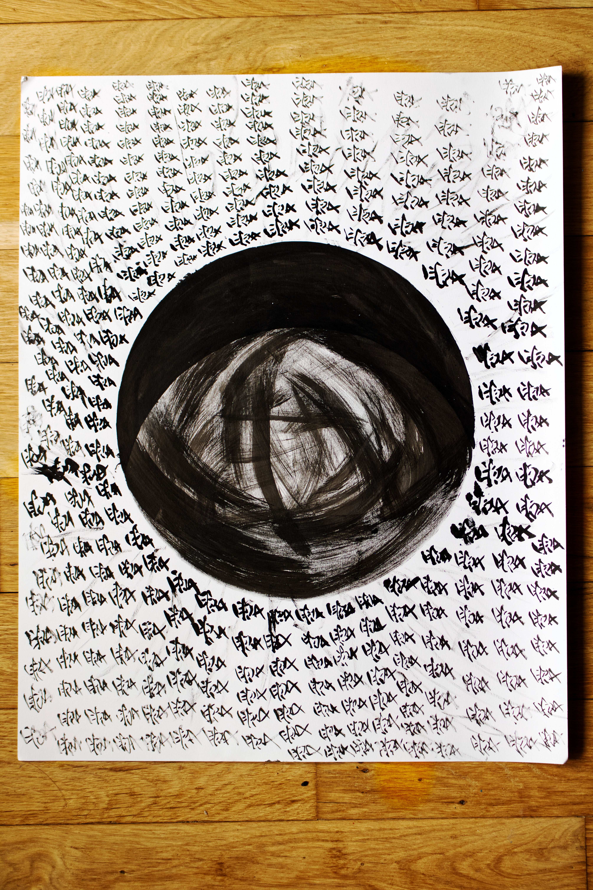
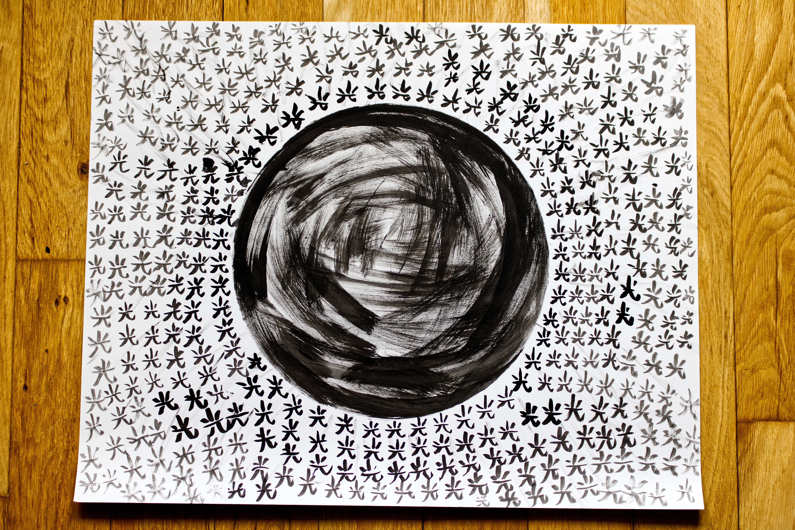

You know that feeling where it's in the middle of the day and suddenly you find yourself thinking of someone? And even though you know it passes, you wish you can just send them some of that magic, wherever they are. These two paintings came from that intention. I wanted to send some love 愛 & light 光 to friends (past, present, and even future) and this felt like the best way to con vey the shapes and full extent of my affection.

I wrote the characters from the center out to capture also the fading of the ink, to mimic the effects of a glowing ball. It was also my first time of using mandarin character to convey literal and abstract themes. My wish is for these two pieces to bring in all the love & light I have in my body and heart to your home, to bless it, to guide you through wherever you're heading in your journeys.

Nothing will make me happier than that.

🖼️ Room mockups are created using AI to help you envision the artwork in different settings. Please note that colors, textures, and proportions may not be fully accurate since the mockups are generated through AI.
#### Song inspiration for this piece: 
[Feel First Life - Jon Hopkins](https://open.spotify.com/track/4esxro8J1rbsalCPb0yrgC?si=404d7887c9c04a7c)

