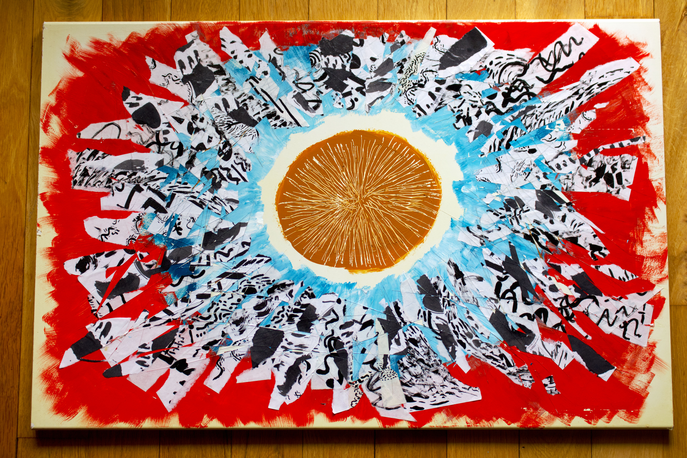

There's something inexplicably magical about taking found objects from the streets of Brooklyn and creating something with it. As someone who's lived here for 12 years, I've gotten so many books, furnitures, and have also put out things for others to take. It's like an ongoing dialogue and relationship I have with the city. The give and take is part of enjoying the pulse of the invisible yet reciprocal ecosystem. So when I found this piece of glossy white refurbished wood (which I'm pretty sure is a part of a dresser) I knew I was going to make the most of it. 

My first thought in working on an object like this is that it felt sturdy. It could hold the emotions, however heavy, I can pour onto it. I had wanted a piece where I can use as a vessel to shape the rage I was feeling. I started by laying down the colors in gouache; a sun in the middle and with expanding hues of melancholic blue and fiery red. Then I ripped apart a stack of A4 papers on which I had practiced creating random ink pattern to displays the "rays" all around it. Then I took the utility knife to just went ham with it. It was as if the first time ever the parts of me that have violent tendencies had a safe space to thrash and slash. I can't explain how when the steam has settled, I felt the sense of peace wash over me. And I mirrored that in this piece by putting a layer of modge podge all over it. Smoothing the hard cuts while layering a glossy layer.

One thing that's hard to convey through this digital screen is just how TACTILE this piece is. I always imagined created art pieces where it's not just pieces where you hang and enjoy looking it. But something you can also run your hands all over as part of the experience. I hope each cut and ridge you feel reminds you that you're not alone in the hurt you feel; how human it all is. And at the end of the day, something I'm returning to time after time is that there absolutely is a light at the end of the tunnel. I hope this piece helps remind you of that.
#### Song inspiration for this piece: 
[Unfold - Porter Robinson & TEED](https://open.spotify.com/track/36kCSJg8ZBwiSCUECFKGUy?si=9dea2eff3a254a8a)

 