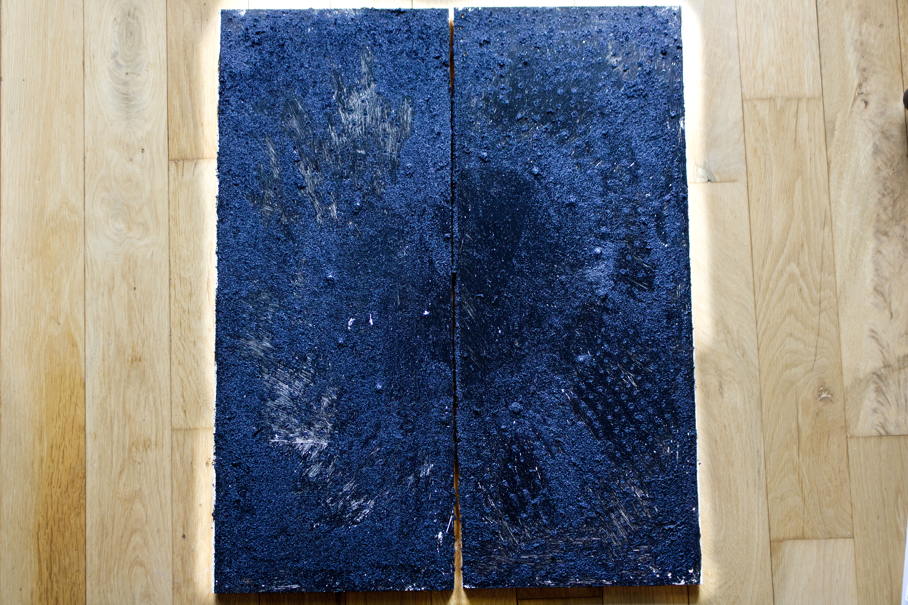

I made this in the final two weeks of the wooden snake year, just before lunar new year, an ending pressing up against a threshold.

The wood is found, likely two side panels from an old Ikea cabinet. For the first time, I didn't just paint on found material, I took power tools to it. Screws arranged in a circle at the center, a portal to move through. Holes drilled all around it, one for every time I neglected myself. Then ink and textured sand to fill them, imagining the black sand beaches of Iceland.

This piece shows the painful yet transformative process of getting to the truth: the body's real capacity, the relational patterns that built into resentment, and the smoke you have to wade through before the grief can finally begin. It is a doorway. What you see on the other side is yours to imagine. What you do next is yours too.

#### Song inspiration for this piece: 
[A Dawning - Olafur Arnalds & Talos](https://open.spotify.com/track/373lcOHga6YNmZRbqycxFe?si=b4244c5368844aa4)

