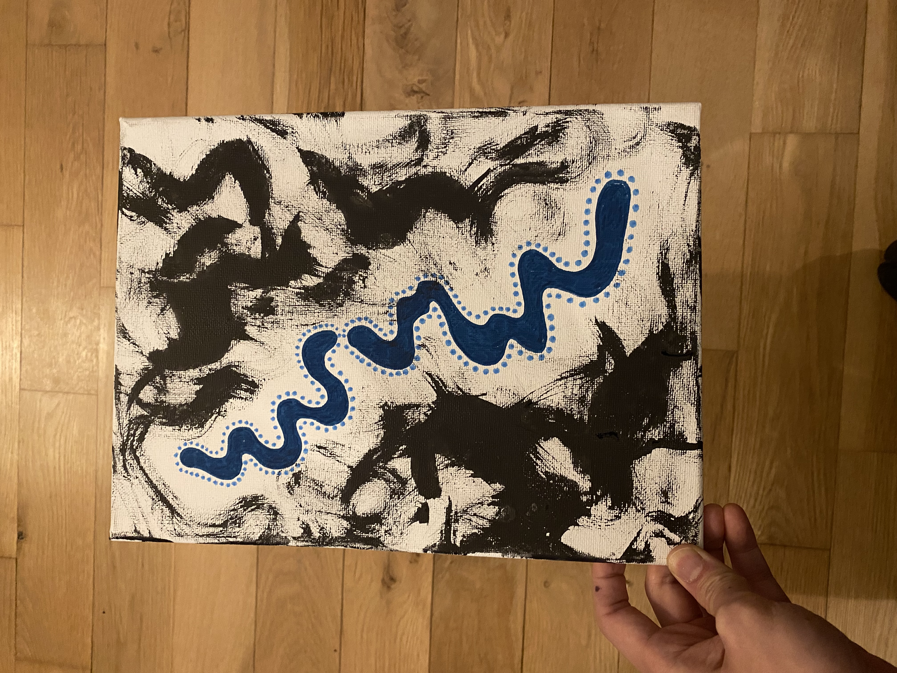

This piece was one of one of the first time I decided to combine two of my prominent mediums and styles: expressive ink strokes with flowy colorful waves. I actually drew this after a long and heavy day, and wanted to conjure up an image that can help me navigate through the stormy waters I was wading through. The ink strokes felt like anger and resentment compressing and suffocating me, and the only way through I can conjure up was to acknowledge the sadness and hurt I was feeling while creating this dotted aura to protect myself. And to weave through it, like an earthworm through dense soil. 

What and how I draw isn't often just for fun, but to survive. When I draw, I hope through this creative and even spiritual act to draw strength from the materials, from the stillness, and even from the well of creativity and love. When I draw, I hope to transmit what I also receive back onto the page to image this regenerative act of giving and receiving love.

I hope this piece reminds you to focus on the things only you can control, to keep believing, and keep surrendering to the flow of life.

🖼️ Room mockups are created using AI to help you envision the artwork in different settings. Please note that colors, textures, and proportions may not be fully accurate since the mockups are generated through AI.
#### Song inspiration for this piece: 
[Breathe This Air - Jon Hopkins](https://open.spotify.com/track/2a1liMR4IUpRsPs9QLN9k1?si=8238f5573c7d4e7a)

