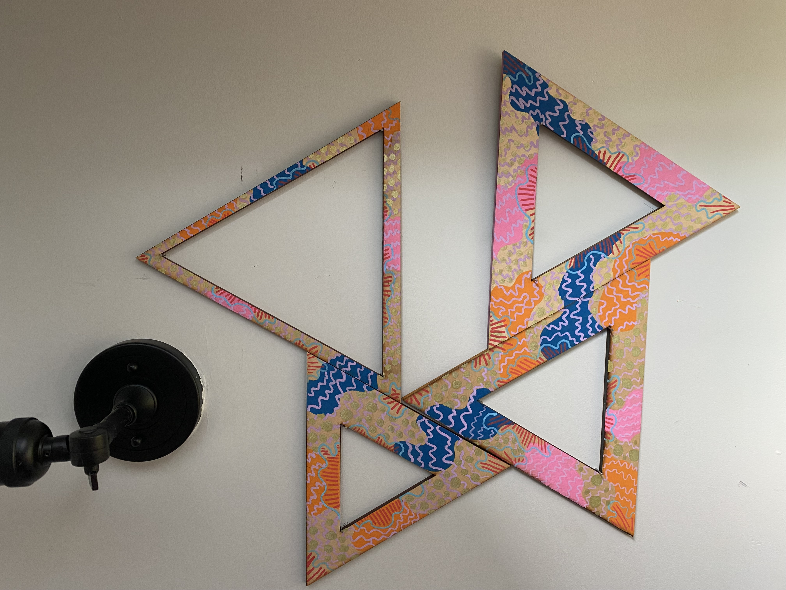

This one-of-a-kind piece was created using found leftover wooden triangle panels and transformed into a sculptural painting. The surface patterns are inspired by ancient Japanese print motifs, where repetition, rhythm, and flow become a kind of meditative expression. I wanted to explore how these four triangles, each carrying its own unique rhythm, could come together to form one abstract piece, like fragments of a story joining into something larger.

The beauty of this work is that it refuses to stay fixed. The triangles can be reconfigured in endless ways, depending on how you choose to arrange them. Sometimes they sit in harmony, sometimes they push against each other — toe to toe, back to back. It’s a piece that invites interaction, change, and play, reminding us that there’s no single right way for things to come together.

🖼️ Room mockups are created using AI to help you envision the artwork in different settings. Please note that colors, textures, and proportions may not be fully accurate since the mockups are generated through AI.
#### Song inspiration for this piece: 
[Tessellate - alt-J](https://open.spotify.com/track/1o22EcqsCANhwYdaNOSdwS?si=352da78532a04d85)

