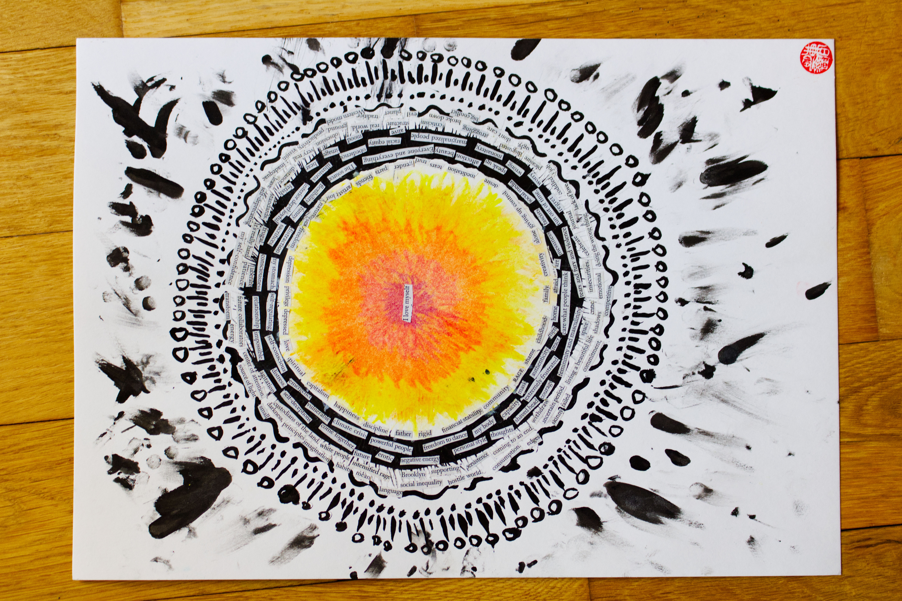

 When I lost my tech job during the pandemic and decided to do something different in my life, it was also the the first time I was making so little money that it qualified me for Medicaid, and 

It's wild to think about how if I had never lost my tech job during the pandemic, I would have never took a bet to try to work for myself, and that I would make so little income that I would qualify for Medicaid, but that also meant I was able to have free weekly therapy sessions that laid the groundwork to my healing path. 

This is a piece that I dedicate to my therapist. For creating the safe container for learning and practicing giving unconditional love to myself. I surrounded the circle with words I found in old New Yorker magazines of all the shapes, themes, concepts, and memories we've worked together on. The tiny circles all around is what I imagined as all of my ancestors, guides, teachers, and spirits all surrounding me giving me the support I needed especially during the hardest sessions.  

Abby, if you are reading this. Thank you for everything.
#### Song inspiration for this piece: 
[Music for Growing Flowers Pt. 4 - Erland Cooper](https://open.spotify.com/album/7nlNFxFHuJxLHtfGM2mAkD?si=qTEMkdEdRMS7ueQQnTk5dg)

