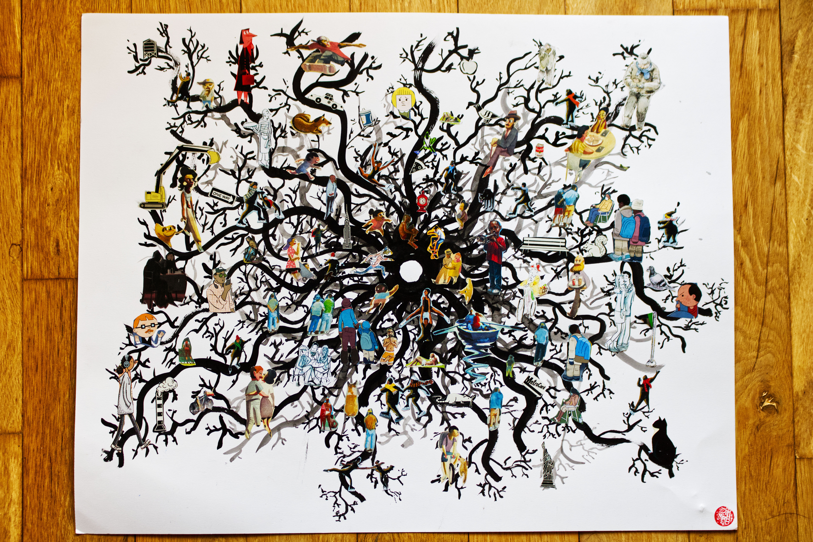

This is a piece to celebrate my 13 years of living in this beautifully chaotic city. 

I dedicated these all the figures I carved out from a stack of old New Yorkers, while imagining them spread out in a web, a root & mycelium network of people. This beautiful ecosystem is what led me to discover and find myself. Especially the inner fire to share my art with this world. 

This piece is for every street corner I walked through, every bodega, every stranger who I observed or smiled at me, every musician busking their hearts out, every time I visited grand central station, every couple I got to witness their love, every cat and dog, and every cup of hot coffee. What gifts of the city do you feel most grateful for?
#### Song inspiration for this piece: 
[NYC Tapwater - billywoods, Kenny Segal](https://open.spotify.com/track/2FUU8kXhJNndeJWABUVvdx?si=03bc14c929284d30)

