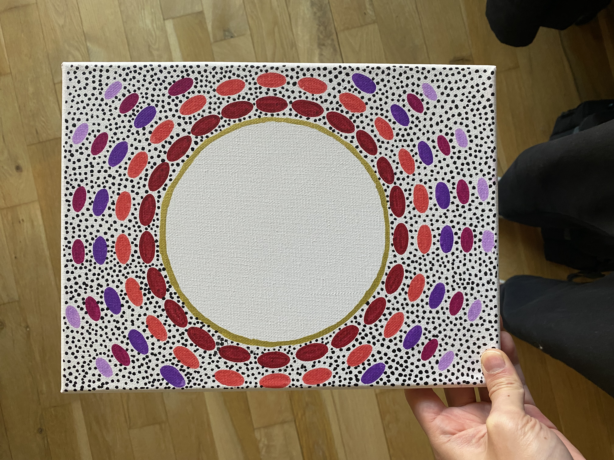

If you've seen some of my work you'll know that I'm obsessed with circles. I encountered that shape on my first ever psychedelic trip and haven't been able to shake off it's shape and what it represents since. I've always referenced this circle as "orb of goodness" and it continues to be a recurring motif in my work (my LLC is literally call OOG Solutions INC). 

I see the orb as love itself: the source of everything, warmth we deserve, that thing we keep yearning for to fill the void we have. Surrounding it, pulsating oval forms in red, violet, and lilac ripple outward like waves reminds us to move toward this love. 

Especially when things get scary. Be well!

For transparency: Room mockups are created using AI to help you envision the artwork in different settings.
#### Song inspiration for this piece: 
[Gold - Cleo Sol](https://open.spotify.com/track/1cwQahQmKdmKaCijjdNEv3?si=0fc07810ac544cad)

