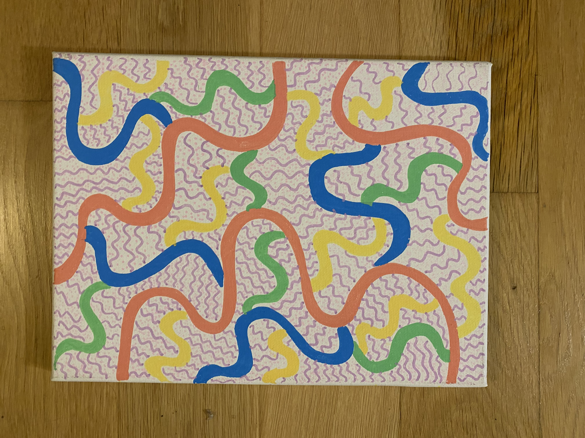
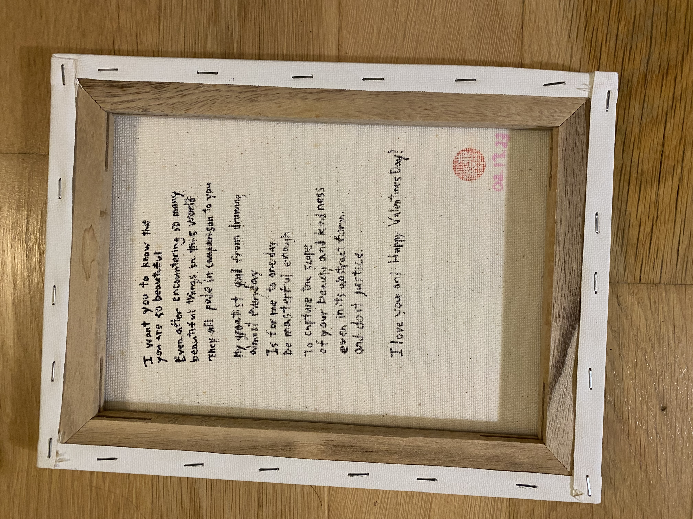

I gifted this piece to my partner as the Valentines Day gift in 2022. 
I've always gifted DIY things even when I was young. I think this has to do a lot with feeling like spending on gifts didn't feel like it fully conveyed or transmitted the love and affection I have for a person. It has always been a dream of mine to be able to gift illustrations and art to others, and to have it be received fully. 

Seeing her feel moved after receiving it and reading the personal note in the back reminds me the journey of creating is always worth it. And even though I didn't have the language back then, I could had already felt how following my creative instincts was such a joyous and regenerative act where things DO come back to me that makes me feel more energized and nurtured; even if it didn't directly translated to money just yet. 

Here's the personal note I included:
*I want you to know that
you are so beautiful
Even after encountering so many
beautiful things in this world,
They all pale in comparison to you.*

*My greatest goal from drawing
almost every day
Is for me to one day
be masterful enough
to capture the scope
of your beauty and kindness
even in its abstract forms
and do it justice.*

*I love you and happy Valentines Day*

#### Song inspiration for this piece: 
[A Case of You - James Blake](https://open.spotify.com/track/6tNrUI6H15kqWBff0HcEZr?si=1f52435071c44d36)

