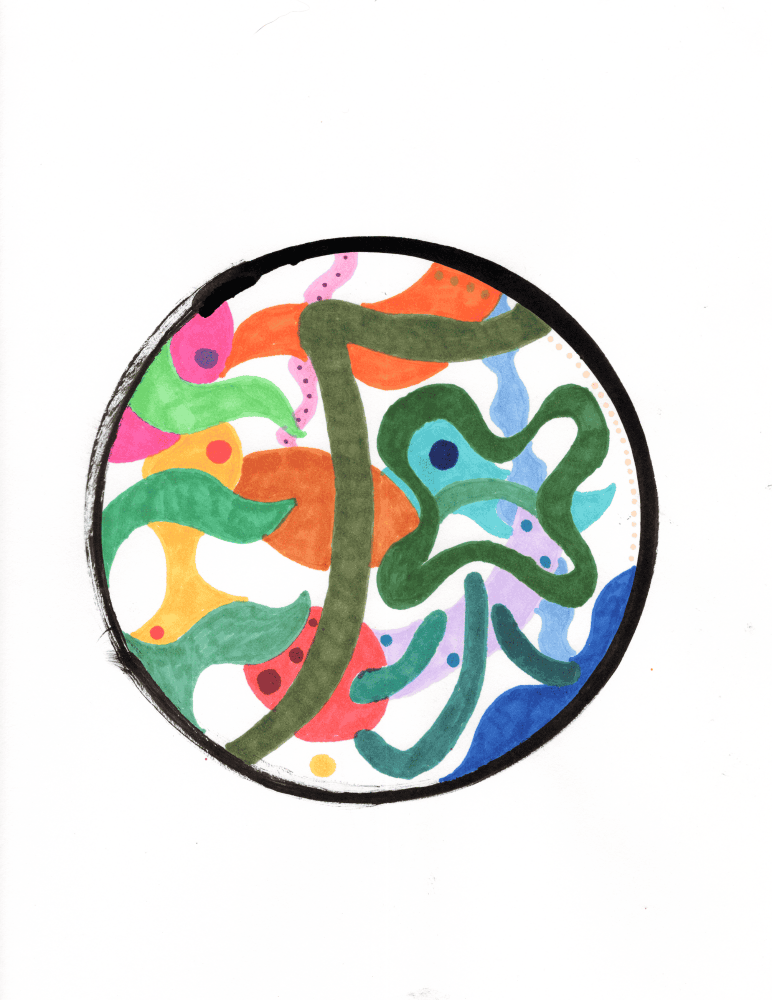

A piece I drew for a friend who recently lost her dog.

I knew I wasn’t the kind of artist who could capture the dog’s realistic features, even with a good photo to reference, but I still wanted to make something that honored his spirit in an abstract way.

Just so happen, the mandarin translation 

#### Song inspiration for this piece: 
[Oneness - Matthew Halsall](https://open.spotify.com/track/1f7M5N7RwsBsVzedAKvwHe?si=115bc9632f714b59)

