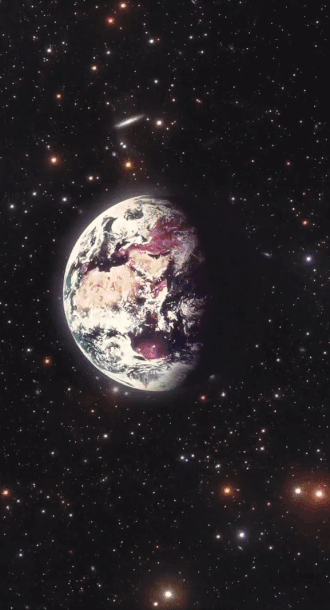

One of my favorite ways to curate a playlist is to tell a story through the songs I’ve picked, and this one is a rather personal one. Many people who have followed this newsletter for a long time or know and have met me in real life know that I’m generally a very positive and joyful person, but not a lot of people know that I suffered from depression when I was an undergrad. I had just gotten out of a long-term relationship and was having roommate issues, all while being far from home for the first time in my life and experiencing a lot of culture shock. There is a quote I later learned from Andrew Solomon’s [TED Talk](https://www.ted.com/talks/andrew_solomon_depression_the_secret_we_share?language=en) that taught me, “The opposite of depression is not happiness, but vitality.” During those turbulent times, I remember how electronic music—as a wellspring of vitality—became accessible to me and injected my life with a powerful rhythm and force. I remember spending hours on end scouring through music blogs and podcasts (before podcasts were even that ubiquitous) just to find more doses of the layers of beats and melodies I could lose myself in. There was something about the rhythms in which I was able to find temporary solace, escape, distraction, joy, and anchors that could hold me down. Over the years, as I have overcome those obstacles, the same music still reminds me of that perseverance and the fight of personal survival for a better tomorrow.

This month’s curation is my attempt to bring you into that space, and to have you travel with me through a hero’s journey in our galaxy. In the beginning, we will launch off into the unknown, picking up speed as we move toward a powerful, gravitational force that pulls us in. The closer we get to that mysterious source of energy, the deeper and more cacophonic the sound gets. At one point we will get dangerously close to that black hole; yet, just when you feel like you’re losing control, you glance up and see our [beautiful earth](https://www.nasa.gov/multimedia/imagegallery/image_feature_1249.html) from afar, just as the crew of Apollo 8 did on Christmas Eve in 1968. It’s enough to remind us to keep pushing forward and to direct our ships back toward what matters most. As we find the fuel and courage to navigate through the treacherous belts of asteroids and space dust, we’re reminded that “home” isn’t even the final destination; the ultimate journey has always been about going beyond and transcending our limited beliefs and ideas. It’s about developing the resilience, skillsets, and power to fly toward the source of light that we know, but unlike Icarus, find a safe and welcoming landing such that we can spend our remaining days basking in the warm light.

<iframe data-testid="embed-iframe" style="border-radius:12px" src="https://open.spotify.com/embed/playlist/6BWXrid9xzZSqlvZ5cn08s?utm_source=generator&theme=0" width="100%" height="1000" frameBorder="0" allowfullscreen="" allow="autoplay; clipboard-write; encrypted-media; fullscreen; picture-in-picture" loading="lazy"></iframe>

