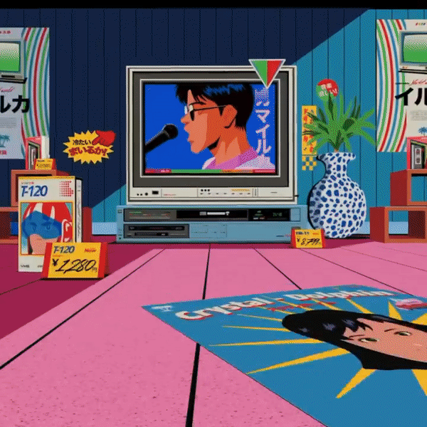

If you are a longtime fan and reader of this newsletter, you may already know that this is one of my favorite times of the year to be curating music. Every year, I like to create a dedicated playlist featuring an entire roster of musicians and artists who identify as Asian (you can also listen to [_Part 1_](https://open.spotify.com/playlist/0vwSfFs51e4rCzLWQHLRkp?si=7a43721cdff644de&nd=1) & [_Part 2_](https://open.spotify.com/playlist/0vwSfFs51e4rCzLWQHLRkp?si=7a43721cdff644de) as well as _I Had a Dream that Asians Took Over Coachella_ [_Part 1_](https://open.spotify.com/playlist/4a59uFErlAJfA4P4Z3w1Rc?si=7fe0e75070574a59) & [_Part 2_](https://open.spotify.com/playlist/3C8yRkK7su07Dy11xhO9AX?si=3f78139c1bcd4d61)) and in the past two years, it has also felt like a timely opportunity to celebrate Asian Pacific American Heritage Month. When creating these playlists, I imagine myself as an A&R Lead, spending hours scouring the corners of Spotify to discover the coolest, chillest, and trillest artists to feature, with the goal of shining a spotlight on artists that I feel are underrated and under-promoted.

This month, I crawled deep into the musical archives to pull out vibes and sounds to combine with modern tracks that are seeing a resurgence in popularity and cultural relevancy. I use the Japanese 80’s City Pop aesthetic and sound as a jumping-off point (which for those who don’t know, sounds like the intersection of vaporwave and future-funk music and is usually paired with retro anime design featuring scenery involving city life awash with pastel colors). Just like any solid festival lineup, I integrate a myriad of genres and styles: from Taiwanese indie-pop to Japanese classic jazz, and Indonesian R&B to Icelandic Chinese singer-songwriter. My hopes are to serve up a delectable auditory omakase experience for you to pair with any upcoming summer festivity. Enjoy!

<iframe data-testid="embed-iframe" style="border-radius:12px" src="https://open.spotify.com/embed/playlist/6cz5hLAhbnV6cnqMrA22Xh?utm_source=generator&theme=0" width="100%" height="1000" frameBorder="0" allowfullscreen="" allow="autoplay; clipboard-write; encrypted-media; fullscreen; picture-in-picture" loading="lazy"></iframe>

