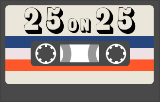

I started making playlists because my friends were constantly asking me to recommend new music to them. Soon I realized that making playlists wasn't just something that was fun for me; it was a love language.  

And it was one very particular way for me to export all the gooey warmth and love I have in my heart and share it with world, with song curation & later paired with a newsletter through a project called 25 on 25. 

Over the course of 90 months, I've handpicked and put together 90 playlists and sent 55 issues of the newsletter. Even though the project has ended, I've decided to create a new home for all that labor of love. 

Now, I’m also offering to curate deeply personalized playlists for others.  
This could be for an event, a gathering, an art show, or simply for a season of your life.  

If this speaks to you, [reach out ](mailto:andrew@codelesscoach.com?subject=please%20curate%20a%20playlist%20for%20me)— I’d love to make something for you.

----

Here was the original copy from the 25 on 25 website: 

A monthly newsletter that includes:
1. A hyper-curated Spotify playlist meant to be listened to in order.  
2. A special theme and description behind each month's curation.  
3. Occasional collaborations with fellow writers, creators, and artists

#### Why?
Playlists created by Spotify are like gourmet processed foods at the grocery store.There's something for every occasion and mood and have solid flavors and variety, but you can't help but wish it was a bowl of hand-pulled noodles made by the grandma at the cart down the street.I want to keep serving you grandma's hearty noodles 🍜

#### When?
I send the newsletter on the 25th of every month at 13:00 EST

#### Who's writing & curating music?
I'm Andrew, a maker who likes to spend his time listening to music and creating stuff. I'm "that" guy that all my friends come to for new music. I listen to 10+ hours of new music each week so you don't have to.

*updated 2025-12-21 21:21*