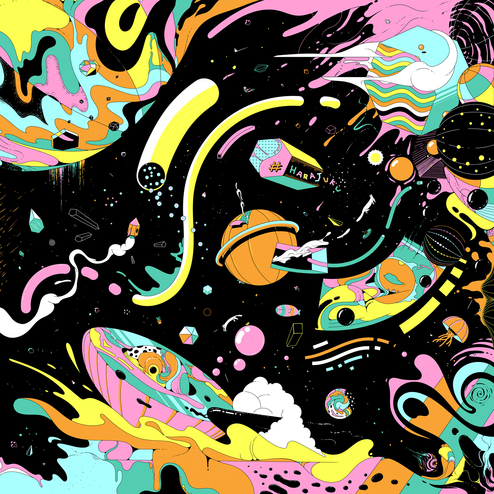

When I think about creativity, I often think back to when I was a little boy playing around in my own paracosms, or detailed imaginary worlds. The one that I spent the most time in was a world I created with my legos, where my protagonist lived in a highly technologically-advanced world battling monsters with spaceships while finding his long-lost love. I would often bring him and his ship to a water-based planet (a bath I drew) and spend hours in it. Just ask my mom—she was often confused about how I could spend such a long time taking baths. I wonder, if only she had walked in once or twice during my baths, whether my mom would have found my protagonist in the precarious situations I designed, perhaps on the precipice of rescuing the long-lost love he spent light years searching for. Looking back at these moments, at the imaginary worlds I created to entertain myself and even the extensive dialogues I created, I am able to truly uncover the childlike and creative being deep within me. 

This month’s theme is all about embracing our childlike imaginations. Combining the first half (soothing and sun-kissed synthy tracks) with the latter half (ambient and spiritual music paired with soothing nature sounds), I hope to convey a feeling of tranquility and transcendence; the kind that can only come from seeing and embracing our inner-child lovingly and completely. 

I would also like to leave you with the opening lines from the first track of this month’s playlist: 
> *We didn't need a story, we didn't need a real world
> We just had to keep walking
> And we became the stories, we became the places
> We were the lights, the deserts, the faraway worlds
> We were you before you even existed*

<iframe data-testid="embed-iframe" style="border-radius:12px" src="https://open.spotify.com/embed/playlist/3gKFZF9dPoeJCYyUZOOBo3?utm_source=generator&theme=0" width="100%" height="352" frameBorder="0" allowfullscreen="" allow="autoplay; clipboard-write; encrypted-media; fullscreen; picture-in-picture" loading="lazy"></iframe>

