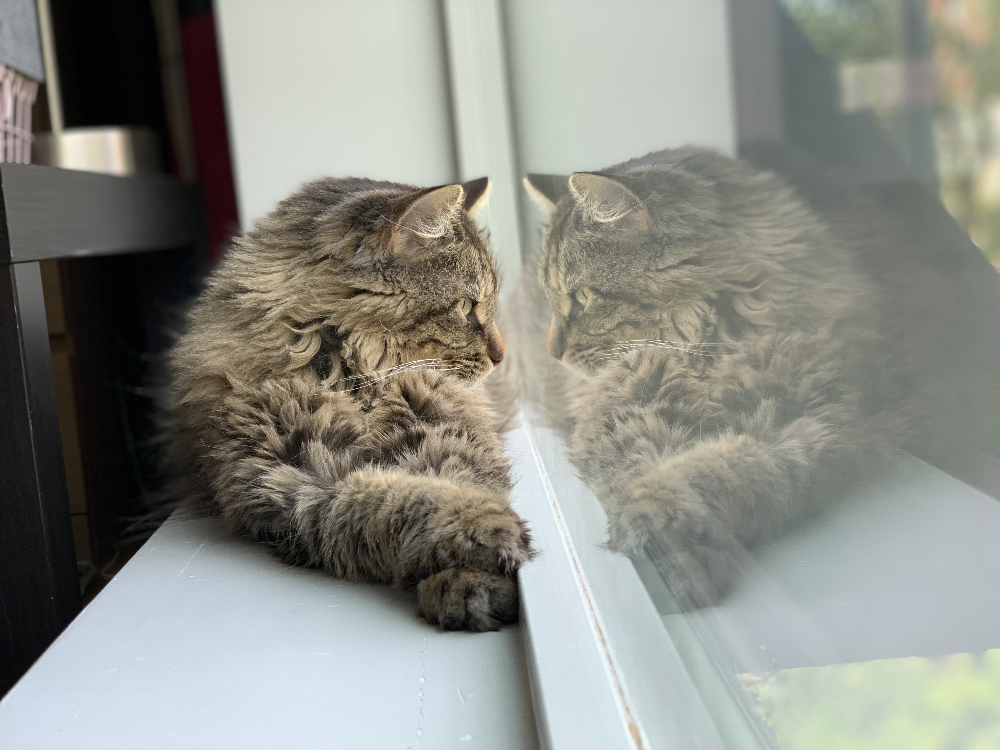

Last week, I shared a [really personal post](https://www.instagram.com/p/Cu74_dHpknV/) on Instagram. 

This was a big deal for me as the last time I shared something on that platform was in April 2020. Because of my own insecurities around the fear of being judged combined with a tendency to compare myself with others, it was always challenging to be on Instagram OR social media. I remember I would often feel worse about myself and my day after just a quick scroll through my feed. I was ready to delete my account altogether as I didn’t feel like it was adding any value to my life.

However,over these last few years of doing a lot of inner work and finding courage to write and share personally in spaces like this newsletter, it has transformed my perspective on what it means to express myself and to share stories, moments, learnings, and reflections through these channels. I’m finally learning the joy of expressing and sharing without an attachment to outcomes nor the attention that I craved in the past. It’s not always easy, but I’m getting there.

This month’s curation is meant to be paired with what I wrote in [that post](https://www.instagram.com/p/Cu74_dHpknV/). I’ve included a wide variety of atmospheric and uplifting electronic tracks to capture the breadth of emotions I feel when reflecting on the journey that has gotten me to where I am today. I hope it will bring you strength, inspiration, and perseverance for wherever you may be going, my friend.

<iframe data-testid="embed-iframe" style="border-radius:12px" src="https://open.spotify.com/embed/playlist/0f2q52rojYKLSvWDOhwSSk?utm_source=generator&theme=0" width="100%" height="1000" frameBorder="0" allowfullscreen="" allow="autoplay; clipboard-write; encrypted-media; fullscreen; picture-in-picture" loading="lazy"></iframe>

