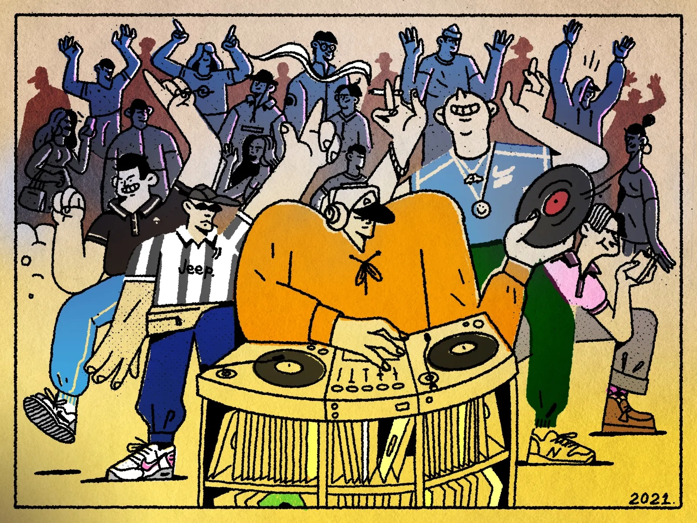

I don’t know about you, but I miss dancing.The feeling of gliding on the dance floor, making a fool of myself with what my girlfriend describes as “dorky” dance moves. I love to lose myself in music designed to make our bodies move. There’s a lot we can learn from dance music. It’s bewildering that something so repetitive can be so exciting and energy-inducing, yet it brings these almost primal ways of moving and being out of us. It’s both liberating and therapeutic and something that I’ve craved for the past year.

This month's theme is all about getting you on the dance floor again. I’ve designed the playlist to carry you from a post-dinner slump into the sweet vibrations of dewy summer evenings. I begin with a few R&B tracks filled with luscious female vocals to get you feeling comfortable. Right after that, I’m bringing my neighborhood vibes to you, introducing a few reggae-inspired tracks that I fell in love with recently. The party doesn’t stop there as I’ll continuously throw you into different dance floors, from deep house to disco.The genres don’t even matter--it’s really all about getting your feet moving and your hips shaking. Finally, I end on a slightly more emotional note because at the end of the night, what I care most about is returning to a home where I feel loved and held. Have a lovely night!

<iframe data-testid="embed-iframe" style="border-radius:12px" src="https://open.spotify.com/embed/playlist/6NbjZMXYfykAChA7Lwkqb8?utm_source=generator&theme=0" width="100%" height="1000" frameBorder="0" allowfullscreen="" allow="autoplay; clipboard-write; encrypted-media; fullscreen; picture-in-picture" loading="lazy"></iframe>

