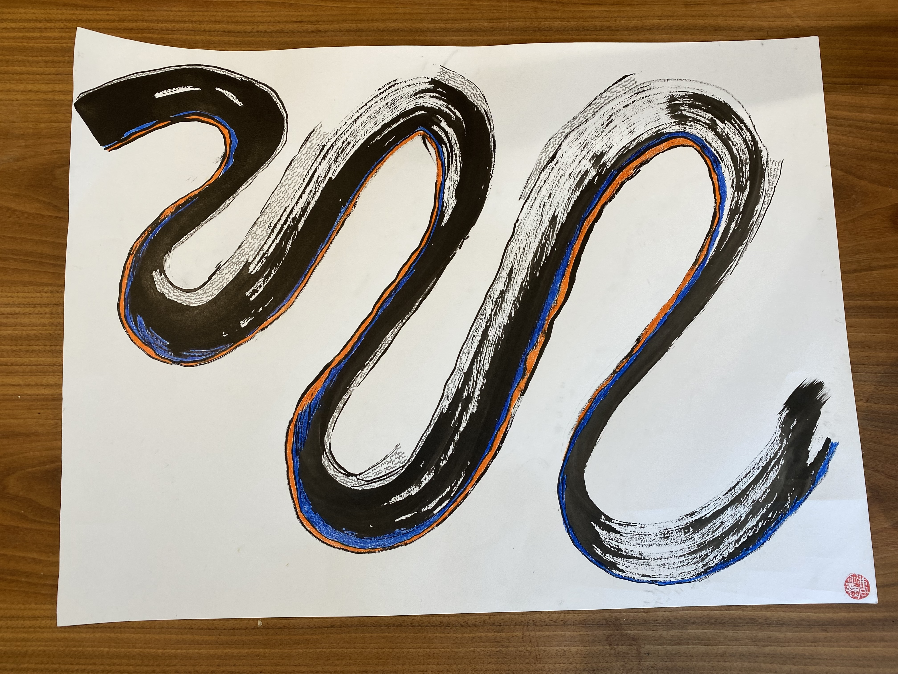

---
title:
publish: true
type: 🌳
published: 2025-12-18
creation date: 2025-12-18
modified: 2025-12-18 21:18:17
status: completed
tags:
  - newsletter
---
I made a tiny promise to myself that I will send at least one issue by the end of this year. And in this issue, I want to be completely transparent about where I was, where I am now, and where I'm going.

I haven't been writing anything here because I didn't have anything to say. 

I was still [writing](https://andrew-tsao.com/my-writing/), [drawing](https://andrew-tsao.com/my-art/), and [sharing content online](https://www.instagram.com/atsaotsao/) but I didn't really know what to do with this particular space. 

And I realize that's mostly because I didn't know how to make this space my own. 

I was still following the blueprint of what I thought a newsletter should be. And I haven't been completely honest with you. 

I started the newsletter initially because I wanted to sell you something. 

Not directly, but I was writing to hopefully create the brand, reputation, and even track record of someone, especially a coach who is *put-together*, *successful*, and *knows-his-shit.*  

I thought if I can convince you that I am someone who knows all the tips and tricks of personal development, building resilience, of navigating uncertainty, of finding alignment in life, of understanding the ins and outs of mindset frameworks, of growing, and being "better" versions of ourselves, that maybe, just maybe you will keep reading, or share with others, and one day sign up to work with me or follow my content somewhere else. 

And this newsletter can contribute to a flywheel of me creating a sustainable business. Sounds great right?

That model may work for others, but I just don't want to subscribe to that anymore. 

I've been spending the past year stepping back from the normalized ways of "building" that asks us to grow fast, convert, and perform expertise.

I've seen that playbook time and time again and have thought that was the only way to do things. 

Only recently am I able to discern and name that underneath it are the deeply ingrained colonial and capitalistic beliefs that cares about extracting attention, convert it to money, scale relentlessly, and perform authority to keep this machine running. 

I'm done with that. 
Or more accurately, I realize I’m not made for that.

I'm someone who wants to choose relationship over reach, reciprocity over extraction, and the kind of writing that may be a little messy but at least feels human. 

That's what painting abstract art daily and doing 1:1 coaching for over 980 hours have taught me.

If nothing I shared above resonates with you, from the bottom of my heart, thank you for being here with me now and before. I will not take it personally if you want to use this opportunity to start cleaning up your inbox and unsubscribe. 

I'll add a unsubscribe button here to make it easier for you so you don't have to scroll all the way down:

Now that I finally got this off my chest, as I am currently reflecting on my year using the [YearCompass](https://yearcompass.com/) (yes it's *very thorough*, but so worth it), I would love to share my wins of the year would also love to invite you to join me in celebrating: 

- This is the first year I stopped waiting for permission and started calling myself, living, and creating as an artist. It only took me 33 years to start fully embracing this deeply creative, gifted, and beautiful part of me, but hey, better than never! 
- Updated my [personal website](https://andrew-tsao.com/) to nest & showcase all my multitudes and work. It’s part website, part archive as an effort to not only show what I do, but also create a living, evolving, and as transparent as possible map of my body of work for anyone to wander and explore.
- After hundreds of hours coaching, I finally figured out what [coaching](https://andrew-tsao.com/coaching) feels like **me** and not what it should be (and people are responding well to it!) 
- A year of committing to taking more relational risks has led to me finally unlearning the deeply-held beliefs and self-protecting patterns of a lone wolf and boy does that feel freeing (& scary).
- Unlearning codependent patterns in my relationships has been by far the hardest things I've ever had to do. But it has also been the work that allow me to feel my soul and body increasing capacity for love and reimagining my life (even the world) from that place.
- Started joining my neighborhood [community garden](https://maplestreetcommunitygarden.org/) and it feels so good learn to include land care as part of self care.
- Hosted my first[ creativity ceremony](https://luma.com/creativity-ceremony-upheaval) with my friend & collaborator Rishi where we laughed, we cried, we danced, we created art, and we shared about our ancestors, our grief, our deepest fears around creativity. Hosting this really changed me on an atomic level, and I know this is just the start.

Funny, I started this year wanting to focus on growing my coaching business but the universe kept nudging me to focus on my relationships instead. 

But I’m learning time and time again that it’s one of the most magical and humbling aspect of committing to the path of surrendering, but more on that later.

Heres what’s in the horizon for me:
- I am moving to Taiwan early next year to start my military conscription duty. Day by day I’m still moving through the grief, excitement, the fear of not being around my partner of 10 years, leaving nyc and home of 12 years and being in the U.S for 15.  
- I’m also planning my very first solo art show! This is related to the move and I wanted to create a gathering intention to say goodbye and celebrate the city, the people that have shaped me, and my creativity journey.

I have no idea what’s going to happen next year beyond that. In many ways it feels like everything is crumbling apart, I’m being asked to examine my edges and my attachments, and there were many days where I can feel my ego clinging, fighting, screaming and like going through horrible withdrawals. I’m currently allowing the moments leading up to the winter solstice portal to hold me.

These days all I can really commit to is being fully honest with myself, with my loved ones, and in my writing and art. 

If you’ve read this far, you are truly a real one. I don’t always read a newsletter to the end these days so I know, and it means a lot. 

What wins and moments do you want to take this moment to celebrate? What is also in the horizon for you?

  

