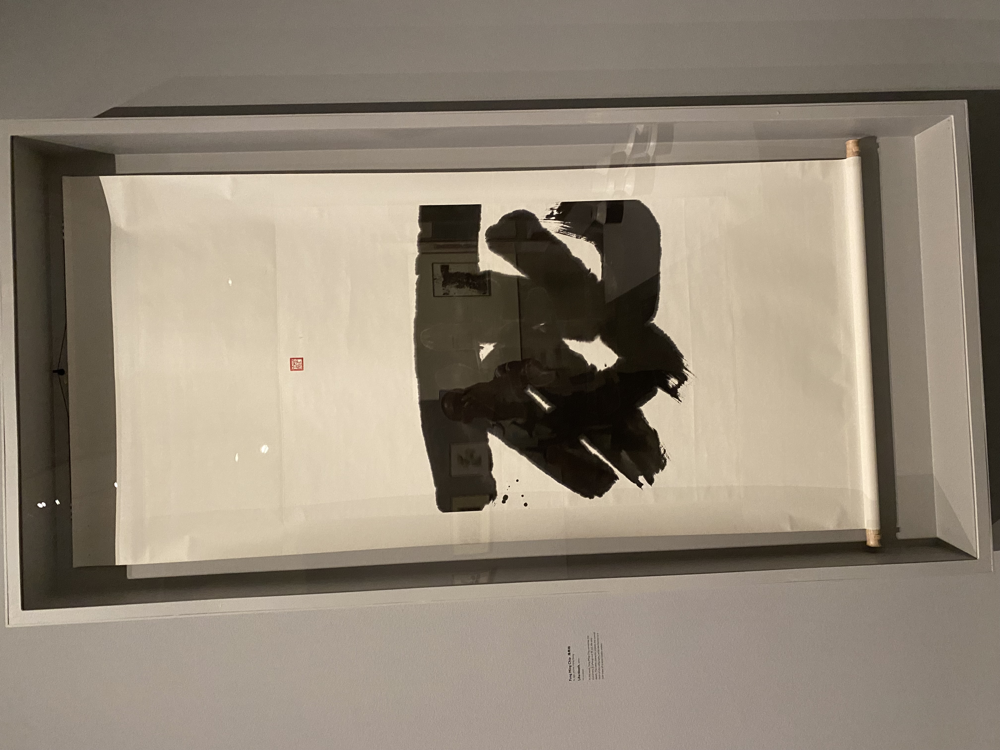

---
title:
publish: true
type: 🌳
published: 2025-10-07
creation date: 2025-10-07 13:33
modified: 2025-10-07 15:07:28
status: completed
tags:
  - thought
---

I've been dying a lot lately.
At first slowly, then suddenly at increasingly and exponentially faster rates.

It's less like decaying, but more like things are slowly crumbling, disintegrating, and melting. Layer by layer and piece by piece. 

At first, I fought these deaths. I resisted it with every ounce of my body.
Because I've been taught that these deaths are dangerous. That I'm in danger. That my loved ones are in danger. That it's not safe to die. 

I thought I was being strong and resilient by keeping death at arms length. But denying it also meant that I was denying what comes after death. By denying deaths I was denying life. The rebirth and living that comes after. The sunrises. The waxing of the moon. The rising of the waves. The green leaves poking out of earth. 

My friend asked me what I am most afraid today and I answered:
"I'm scared of resisting deaths."

I want to allow it to move through me because I trust where it's all guiding me.
The wind is blowing, and I am finding the courage the slowly let go of holding onto the ground so tightly.

I am allowing myself to reimagine the process of uprooting, that it doesn't have to be as violent as my grandparents had experienced. 

New soil welcomes me, and I am finally ready.

