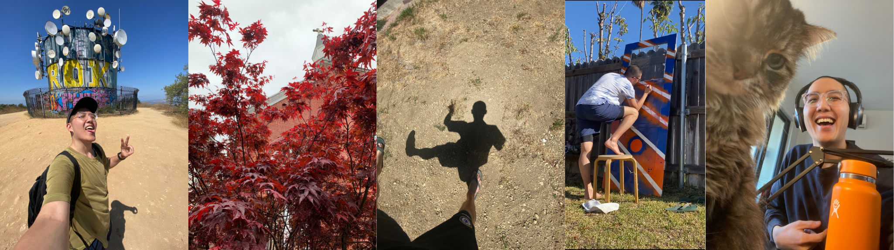

- **Hosting** the [Creativity Ceremony](https://luma.com/creativity-ceremony-upheaval) in December with my friend [Rishi](https://www.emergencewizard.com/)
- **Exhibiting** my first body of work in a [solo art show](https://partiful.com/e/pWY1jjI1VetZvFDs1GrT) early next year
- **Coaching** [1-on-1](coaching.md) with soul-led professionals, deep feelers, artists, and creative entrepreneurs.
- **Reawakening** [_The Art of Your Life_](https://open.spotify.com/show/5GSZxqie8yWDupBkTTMoSF?si=04653a28642642fe) podcast—breathing fresh life into it soon.
- **Mentoring** as a part-time internship assessor for the [NUS Overseas program](https://enterprise.nus.edu.sg/education-programmes/nus-overseas-colleges/) in NYC.
- **Building** websites slowly, patiently, inclusively, for aligned collaborators—like [this one](https://www.mainlanderstl.com/) for a chef in St. Louis.
- **Tending** and composting in my [neighborhood garden](https://maplestreetcommunitygarden.org/).
- **Painting** [abstract works](my%20art/index.md) as a liberatory practice.
- **Remembering** my lineage by archiving and reweaving the artifacts of my late grandparents.
  
I am interested in creating and joining spaces, projects, and movements that **hold spaciousness for questions like these**:
- *What does it mean to live in alignment with our truest selves?*
- *What is freedom and how is our individual freedom bound up with collective liberation?*
- *What has been lost in our ancestry and lineage? How can we reconnect, reclaim, and receive its wisdom to guide us now?*
- *How do we embody love and light in ways that honor complexity?*
- *How might land care become inseparable from personal care?*
- *How do we remain resilient, abundant, and loving in times of crisis and uncertainty?*
- *How can our relationships, communities, and ecosystems thrive on reciprocity?*
- *How do we honor our multitudes, our woven artistry, and harness them to reimagine the world?*

📚 Reading:
- Free Play: Improvisation in Life and Art
- Emergent Strategy: Shaping Change, Changing Worlds - Adrienne Maree Brown
- Kindred Creation: Parables and Paradigms for Freedom - Aida Mariam Davis
- We Need Your Art - Aime McNee
- The Wretched of the Earth - Franz Fanon

🎧 Listening to: 
- Sons of Spergy - Daniel Caesar
- The Awakening - Ahmad Jamal Trio
- EUSEXUA - FKA twigs

✨ MISC:
- Repeatedly dying in the video game Hades 
- Embracing the season of watching Halloweeny movies

*(updated 2025-11-19 11:45)*